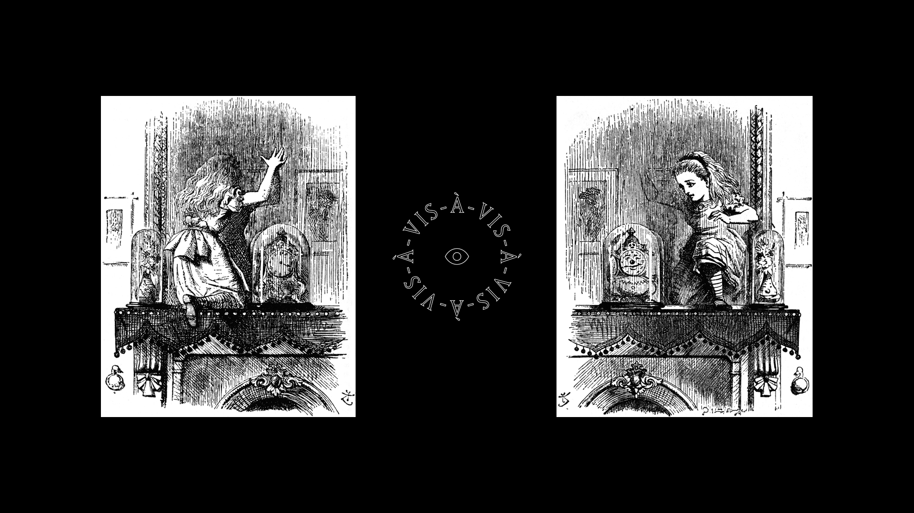

 
The virtual reality installation transports the visitor to a place “behind the mirror”. The Lacuna is a volatile room that keeps changing around its guest – shifting in scale and mutating its architectural features – while revealing traces of poetic narratives.
Loosely inspired by Lewis Carroll’s Alice books, it combines sound, text and imagery into an alternate surreality.

## Through the Mirror

Before putting on the HMD, the viewer is confronted with a mirror.
Upon entry into VR this scenario is duplicated and the viewer is able to see him/herself one last time (through a hidden camera) before the whole room starts to shift.

Instead of travelling through a world the world shifts around the spectator, at times covertly behind the back, sometimes in plain sight.

 

###The Gaze is Present
Disembodied, the viewer’s gaze becomes the only instrument of connecting to this space – it leaves traces, activates and builds structures.

###Impossible Space

[plugin:vimeo](https://vimeo.com/257996402)

The Lacuna’s architecture rejects its passive role as a trusted, immutable shelter and permits a physically impossible experience of poetic space and a reflection about the fragile relation of the beholder to her/his environment.

###Architectural Acts
One cannot enter the same room twice.

Lacuna’s unstable architecture is based on a parametric wall system that allows for ever changing spatial configurations.
Walls can mutate, change dimensions and their materiality, etc
Thus, one cannot enter the same room twice. Each viewer will experience a different “journey”, manifesting different aspects based on her/his behaviour and the world’s own erratic character.

###Narrative as Potential
Instead of a linear story, The Lacuna Shifts uses a modular, hypertextual system that consists of text (spoken and written), wall graffiti, objects, animations and the architectural character.

In a partly self-referential fashion, all these modules deal with the very “nature” of the virtual space and refer to concepts of ambivalence, sight, presence and manifestation. For instance, the maybe most dominant object is the upside-down candle, which refers to early drawings of the camera obscura. This image may serve as a literal reference for a closed, dark chamber as well as a metaphor for a telepresent, upside-down and projected parallel world.
Through dynamic recombination, a hermetic accumulation of symbols and literal fragments is constructed. It aims toward a dense narrative potential, which becomes manifest in each individual guest.