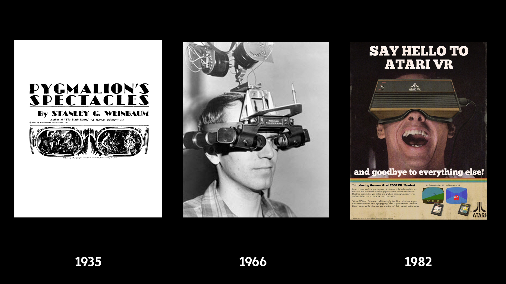
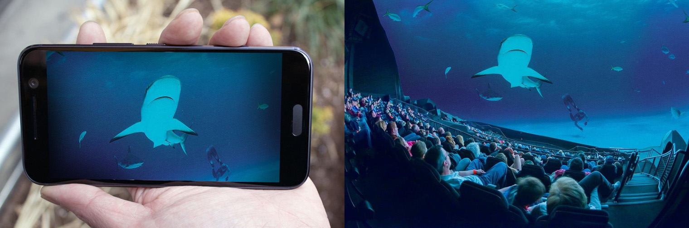
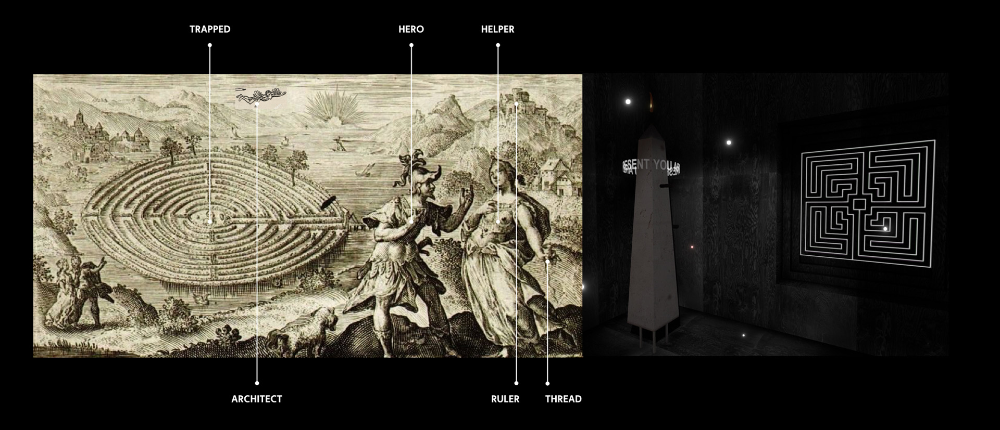
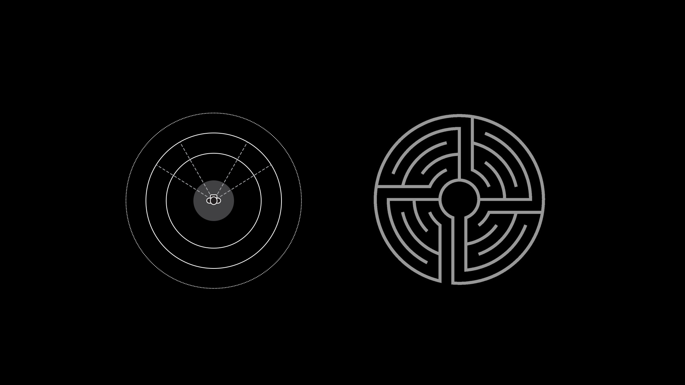

 
Virtual reality (VR) represents the abolishment of the artistic tradition of framing . The spectators' natural freedom of gaze puts them at the centre of the work.
Denied a purely passive role, they are nevertheless generously rewarded by a previously unattainable sense of presence. The totality of the image leads to their isolation , which represents both the challenge and potential of the medium and demands a complex, new approach in terms of narration and spatial experience.

##VR as an artistic medium

Since the 1980s, VR has persistently returned, each time with utopian promises and each time, to ultimately (as it seems) fail due to technical shortcomings. Every failure inevitably brought with it the disappointment of the users, leading to the rejection of ideas followed by a period of indifference. So even the current boom feels more like a new start than the continuation of a long history. VR once again finds itself in a phase of spectacle, mimesis and skeuomorphism . The still “inexperienced” VR audience is already overwhelmed by the credibility of the virtual experience itself. In this text, I refer to virtual reality (VR), which, unlike augmented reality (AR), is completely immersive and—unlike the 360° video—is computer-generated in real time. For now, we can name three distinguishing features that set VR apart from other media:

- The virtual takes up the spectator’s entire field of vision. It is total. (display)
- The virtual can be observed with a “natural” freedom of gaze (interface). Its perspective is constantly aligned to the moving head of the spectator and it can be perceived in a stereoscopic fashion.
- The gaze is present! The viewer’s gaze is general knowledge in the VR world. What’s more: it can be used to construct and change it.

This means the HMD (head-mounted-display) is not only a display medium, it is also always an interface. Interaction is therefore not a choice, it’s unavoidable.

###THE SELF IN A BETA METAMEDIUM

VR describes the ideal of the total medium. Once the HMD has been put on, it becomes invisible; the technology disappears. As such, it is potentially the beginning of the ultimate medium that can simulate and absorb the rules of all others— the virtual living room with a simulated television, the virtual visit to a museum, etc.
VR represents the logical end of a path that has long since been trod in our society: the quest for an omnipresence of our media and, at the same time, their full transparency in the sense of an invisibility of interfaces,
technologies and (the denial) of the act of mediation.

The abolishment of spatial boundaries (immersion), immediate actuality (presence) and physical perception (embodiment) are the key strengths of VR. In addition to the total display, these qualities result primarily
from the direct reference to the viewer’s body.

Firstly, this is done by keeping the proportions in relation to the audience. While the film is forced to scale from the mobile phone to the IMAX format, in VR the viewer remains the direct measure of things. Secondly, the
medium ensures the perspective is adjusted in a synchronised manner—the viewer always remains in the vanishing point of the world and is therefore at its centre. The auditory component should not be underestimated
here either, since sound can also use these viewer-centric spatial relationships. This first person perspective leads to the fact that viewers can embody practically any entity in VR—from living beings to lifeless
objects:

>“You might as well be a mountain range or a galaxy or a pebble on the floor. Or a piano … I’ve considered being a piano. I’m interested
>in being musical instruments quite a lot.”
>[Jaron Lanier, (Interview in: Whole Earth Review, Fall 1989).](http://www.jaronlanier.com/jaron%20whole%20earth%20review.pdf?classes=tiny)

###SPATIALITY, ORIENTATION SHOCK AND PORTABLE CATHEDRALS

Virtual reality is to an overwhelming extent architectural—both in terms of its experience and in its design. So, it is hardly surprising that architects have a keen interest in VR for pre-visualisation work. Conversely, however, this very expertise is necessary for any VR work. VR needs virtual architects and their long tradition of psychology and poetics of space. If we look at VR in the sense of the ancient labyrinth myth, would the artist then be Daedalus, the architect? Would the viewer then be the imprisoned Minotaur or Theseus, the hero? Who or what would take over the role of Ariadne and her thread?

As soon as we enter a building, we begin to read and decrypt it. We look for routes, exits, assess our ability to move around—in short: we orient ourselves.
While there are spatial transitions in consensus reality that facilitate this decoding work, the entry into VR starts
with orientation shock. The unexplained “Who am I?” is stressful. Transpose this idea to VR and scene-setting potentially begins before the viewer puts on the HMD. How can we weave the transition from real to virtual
space into the entire narrative? Does it make sense to bind the virtual to an actual place in order to absorb this disorientation?

Umberto Eco speaks of the cathedral as a kind of permanent and immutable television programme providing people with advice for their daily lives and their salvation. This literary function of architecture and
the spatial and sculptural design of information is combined in VR with dynamic and interactive possibilities.
VR as a portable place of refuge, contemplative cultural space and a sanctuary for private reflection, relaxation or intellectual activation.

The staging of Michelangelo's The Creation of Adam  and the context in the Sistine Chapel—having to tilt one’s head upwards, becoming aware of one's own insignificance—are lost. The two index fingers salute from mugs and T-shirts, in remixes and collages, books, smartphones, magazines and living rooms including meta-information and as part of an eclectic flood of images.

Through its almost total isolation, VR offers the purest clean slate achievable for the first time in media history. There are no non-work-related set pieces or reactions from fellow human beings in the entire field of
vision. Each element is part of a total artistic design—the ultimate, virtual gesamtkunstwerk.

Immersion in virtual reality also leads to an extraction from consensus reality. In VR, I am alone. This deprives the audience of one of man's most essential experiences as a social being: the shared experience. The
HMD acts as a blindfold, which further promotes a sense of vulnerability and a loss of control. Many users cannot completely turn off their thoughts about their appearance to bystanders.

###NARRATION

The comparison with film as a narrative medium is very problematic. Firstly, film is based on a linear sequence of fixed (designed) images, which is immediately undermined by the freedom of vision in VR. The viewer becomes an (amateur) camera and thus takes over a part of the direction.
Secondly, in classical narration, action unfolds retrospectively in scenic sequences. The central method to storytelling is based on jumps in space and time (cuts). Owing to the sense of presence in VR, the two
can only be achieved indirectly. In many aspects, this reveals a closer relationship to performing arts.

###IDENTITY CRISIS IN THE FIRST PERSON SINGULAR, PRESENT TENSE.

Uptake of VR is still in its infancy, so there is a lack of generally accepted genre conventions such as the fourth wall. From an artistic perspective, this freedom is naturally extremely exciting. However, the absence of reception standards can also lead to uncertainty and frustration among viewers.

Coupled with the orientation shock and the partial loss of one's own physicality, an identity crisis arises that poses the following existential questions:
Who am I (here) and how did I get here? Where is my body and do I even need one? Does the world acknowledge my presence or do I have a ghostly existence? Am I
a spectator or a protagonist?

The virtual embodiment becomes an integral part of the narration and the overall experience. The narrative technique of jumps in time and space or the externally-controlled camera is therefore often inadequate.
Another strategy focusing on spatial coherence and a contemporary experience is closer to the nature of the medium. VR offers immediate, individual experiences that are happening now. Instead of recounting a story, it
can create experiences that invoke their own stories as the events unfold—every one of them different for each viewer.

###STEPPING OUT OF THE FRAME

It is obvious that VR is ready for emancipation: it strives to become an artistic medium in its own right, adding to the canon of film, theatre, architecture, literature and such forth.
VR needs its own avantgarde movements to find its place and establish its genres. My artistic practice is mainly concerned with audiovisual systems, which always give rise to the unexpected by means of
cross-modal emergence and which aim for a complex, poetic individual experience. This real-time experience demands a degree of attention that is hardly achievable within the tight boundaries of the screen.
For me, VR is the long-awaited medium that allows a digital work to be experienced directly. It promises nothing less than to give the digital medium a phenomenologicalquality similar to nature, making it equal
to the genuine experience in several respects.