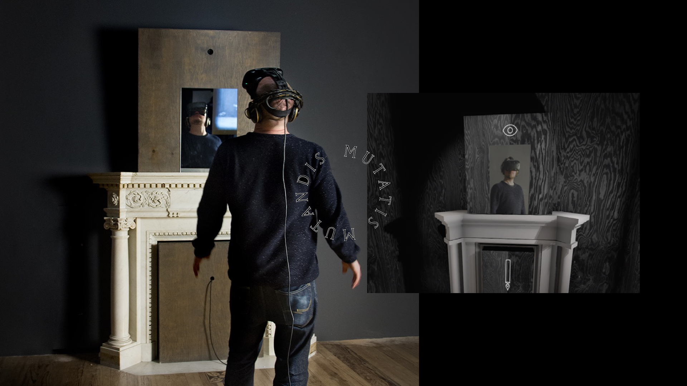
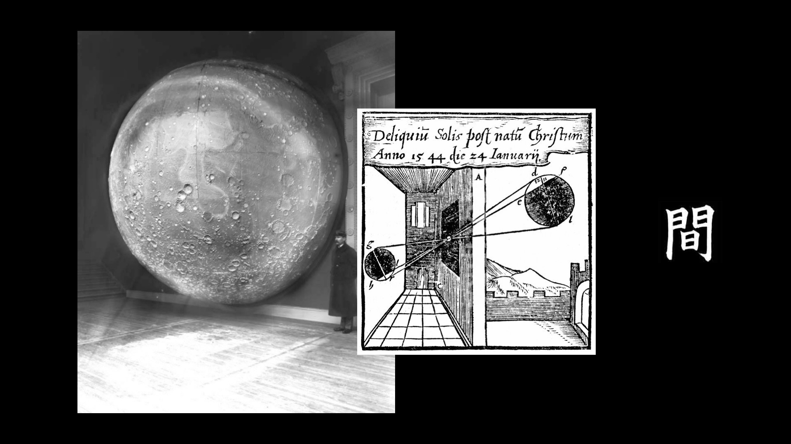
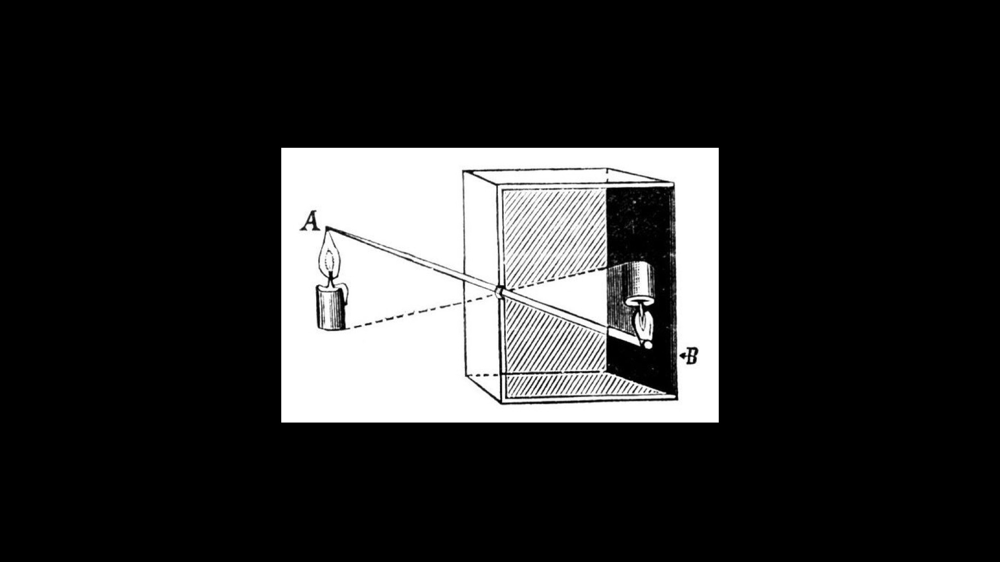

 
The reality melting abilities of VR and its metaphoric references were the starting point for an artistic exploration of the medium that lead to [The Lacuna Shifts](http://depart.at/portfolio/the-lacuna-shifts/) – a spatio-poetic VR experience whicht transports the visitor to a place behind the mirror. 

When asked by [sound:frame](http://soundframe.at) and [OK Linz](http://www.ok-centrum.at/) to create an artwork relating to [Alice in Wonderland](https://en.wikipedia.org/wiki/Alice%27s_Adventures_in_Wonderland) the choice of VR struck us as the perfect fit. 

Inspired by Lewis Carroll’s books we created the “Lacuna” – a volatile space that keeps changing around its guest – shifting in scale and mutating its architectural features – while revealing traces of poetic narratives. 

## Through the Mirror

The first thing that struck us is the accepted harshness of the transition into VR – if it can even be called one. We wanted to address this and create a clear entry scenario, that would tie the physical and the virtual place together - with an obvious [reference to Alice](https://en.wikipedia.org/wiki/Through_the_Looking-Glass).

Before putting on the HMD, the viewer is confronted with a mirror. Upon entry into VR this scenario is duplicated and the viewer is able to see him/herself one last time (through a hidden camera) before the whole room starts to shift.

Instead of travelling through a world the world shifts around the spectator, at times covertly behind the back, sometimes in plain sight.

 

###The Gaze is Present
Disembodied, the viewer’s gaze becomes the only instrument of connecting to this space – it leaves traces, activates and builds structures.

###Impossible Space

[plugin:vimeo](https://vimeo.com/257996402)

The Lacuna’s architecture rejects its passive role as a trusted, immutable shelter and permits a physically impossible experience of poetic space and a reflection about the fragile relation of the beholder to her/his environment.

###Architectural Acts
>One cannot enter the same room twice.

Lacuna’s unstable architecture is based on a parametric wall system that allows for ever changing spatial configurations.
Walls can mutate, change dimensions and their materiality, etc
Thus, one cannot enter the same room twice. Each viewer will experience a different “journey”, manifesting different aspects based on her/his behaviour and the world’s own erratic character.

###Narrative as Potential
Instead of a linear story, The Lacuna Shifts uses a modular, hypertextual system that consists of text (spoken and written), wall graffiti, objects, animations and the architectural character.

In a partly self-referential fashion, all these modules deal with the very “nature” of the virtual space and refer to concepts of ambivalence, sight, presence and manifestation.

####The Cosmos in the living room

####The obscure chamber

The maybe most dominant object is the upside-down candle, which refers to early drawings of the camera obscura. This image may serve as a literal reference for a closed, dark chamber as well as a metaphor for a telepresent, upside-down and projected parallel world.
Through dynamic recombination, a hermetic accumulation of symbols and literal fragments is constructed. It aims toward a dense narrative potential, which becomes manifest in each individual guest.