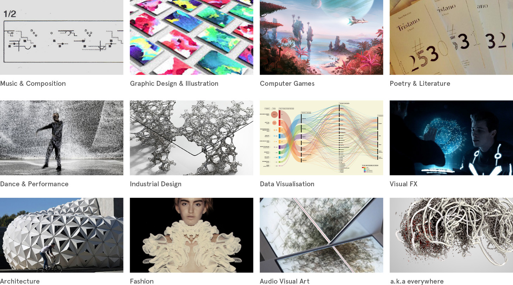
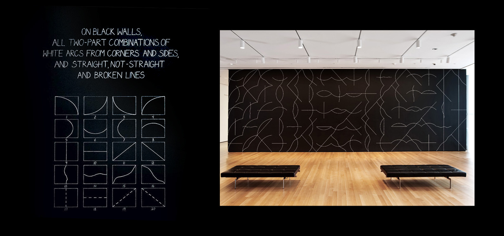
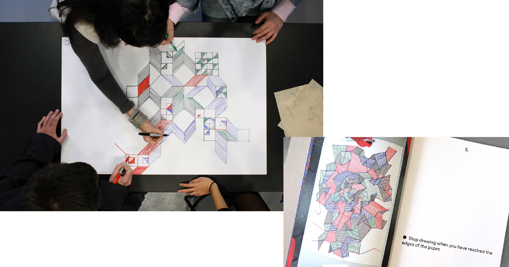
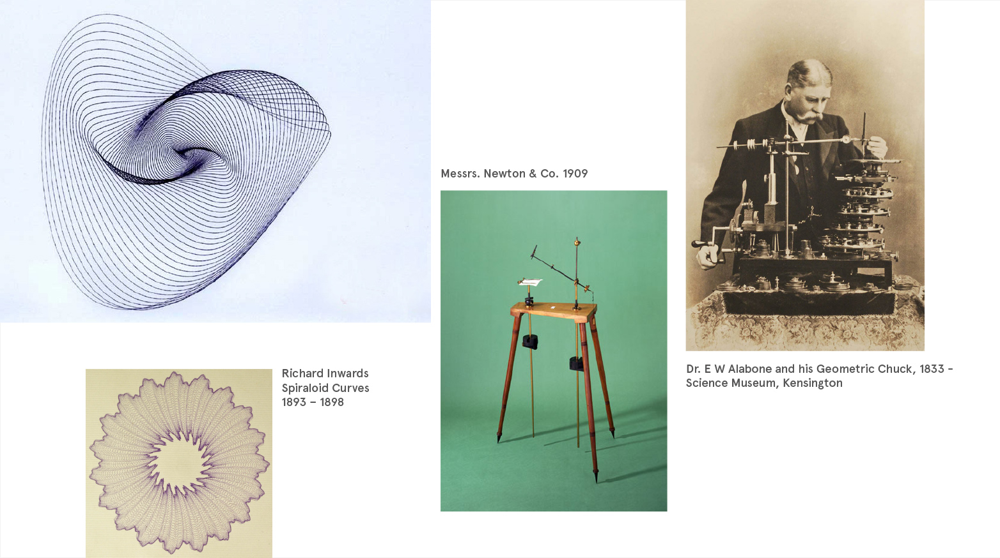
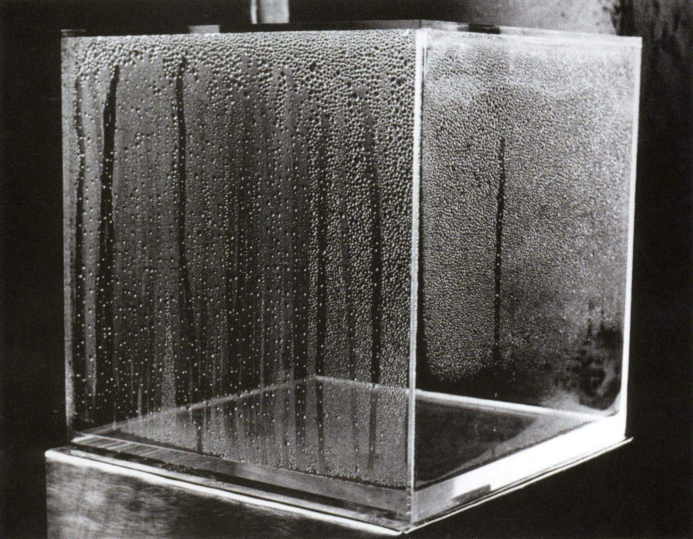
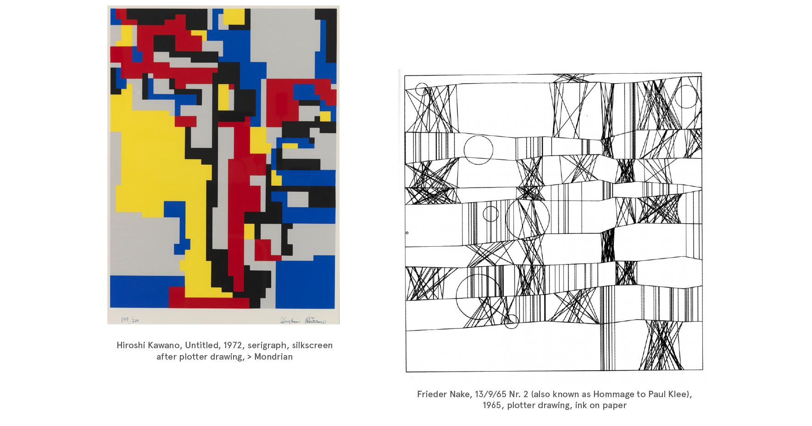
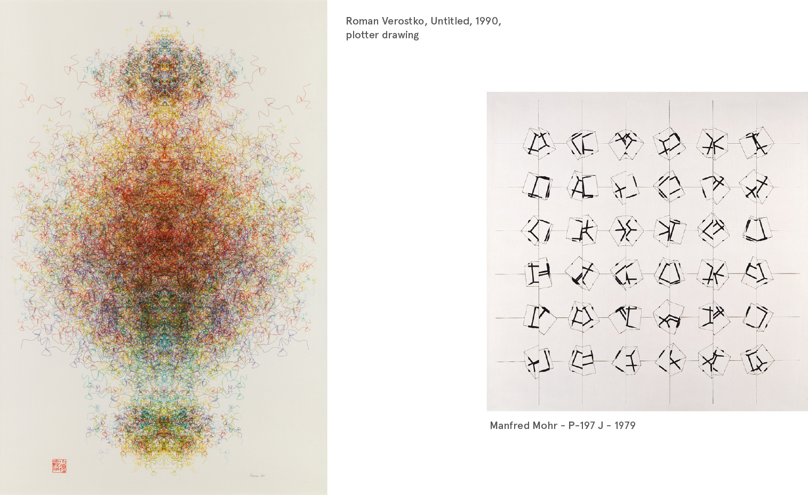
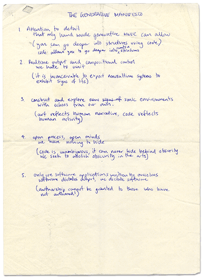

 
This article is a short introduction to the use of algorithms and systems as a creative and critical medium in art and design. 
It outlines a historic view of the subject, but neglects a strict chronology in favor of grouping similar concepts throughout time. 

The extensiveness of the subject which encompasses almost every aesthetic field and the fact that a lot of its developments happen in parallel makes it almost impossible to come up with an effective linear timeline. 

Although its history is very old and predates the digital age by far and it is omnipresent in todays computerised creative industry (and art world) - it still seems to be a neglected field which is largely unknown to the general public and ist often cast into a geeky niche.  
Except the very nature of generative design points to the exact opposite: In dealing with the ideas and quantifieable rules behind aesthetics, it presents a meta-design approach that is by definition extremely generic and has widespread applications in all aesthetic disciplines.  

From its old age and broad scope stems the lack of a singular clear label. "Generative Art" is part of a diffuse list of terms and genres which often employ very similar concepts from a slightly different angle: 

[Generative Art](https://en.wikipedia.org/wiki/Generative_art), [Generative Design](https://en.wikipedia.org/wiki/Generative_design), [Generative Music](https://en.wikipedia.org/wiki/Generative_music), [Algorithmic Art](https://en.wikipedia.org/wiki/Algorithmic_art), [Algorithmic Composition](https://en.wikipedia.org/wiki/Algorithmic_composition), [Systems Art](https://en.wikipedia.org/wiki/Systems_art), [Process Art](https://en.wikipedia.org/wiki/Process_art), [Cybernetic Art](https://en.wikipedia.org/wiki/Cybernetic_art), [Computer(-Generated) Art](https://en.wikipedia.org/wiki/Computer_art), [Software Art](https://en.wikipedia.org/wiki/Software_art), [Digital Art](https://en.wikipedia.org/wiki/Digital_art), [Interactive Art](https://en.wikipedia.org/wiki/Interactive_art),  [Parametric Design](https://en.wikipedia.org/wiki/Parametric_design), [Design Computing / Computational Design](https://en.wikipedia.org/wiki/Design_computing), [Computational Creativity](https://en.wikipedia.org/wiki/Computational_creativity), [Procedural Modeling](https://en.wikipedia.org/wiki/Procedural_modeling), [Procedural Animation](https://en.wikipedia.org/wiki/Procedural_animation), [Metadesign](https://en.wikipedia.org/wiki/Metadesign), [Creative Coding](https://en.wikipedia.org/wiki/Creative_coding), and many more.

The keywords are:   
generative, algorithmic, procedural, parametric, conditional, computational, computer generated, rule-based, systemic…`

###Definitions

I especially like the following famous quote by Sol LeWitt to sum up the core concept:

>The idea becomes a machine that makes the art.  
>[Sol LeWitt ("Paragraphs on Conceptual Art," 1967)](http://emerald.tufts.edu/programs/mma/fah188/sol_lewitt/paragraphs%20on%20conceptual%20art.htm?classes=tiny)

A bit more detailed, Philiip Galanter defines it this way:

>Generative Art refers to any art practice where  
>**the artist uses a system**, such as a set of natural language rules, a computer program, a machine, or other procedural invention, 
>which is set into motion with **some degree of autonomy**  contributing to or resulting in a completed work of art.  
>[Philip Galanter: What is Generative Art?, 2003](http://www.philipgalanter.com/downloads/ga2003_paper.pdf?classes=tiny)

We can therefore lay out a few specifics that describe generative art 

- It employs a set of rules/conditions eg. to modular entities
- It is systemic and has a degree of autonomy that often leads to emergence
- It generally has some kind of feedback loop
- It usually involves some kind of selection process (eg through the artist's aesthetic vision)
- It is not exclusively technological/digital
- It may be applied to any aesthetic endeavour

##A beginning —   Non-technological design systems
### Modular Systems - Combination, Permutation, Aleatorik
<!-- 
https://en.wikipedia.org/wiki/Gamebook
https://en.wikipedia.org/wiki/Choose_Your_Own_Adventure
Cage
Surrealist Language Games

-->
Simple modular systems which are based on the combination and permutation of defined elements date back to the very beginning of art. It can be found in ornaments as early as 5000BC.

, p102ff - mentioned in Alan Dorin, Jonathan McCabe, Jon McCormack, Gordon Monro & Mitchell Whitelaw (2012) A framework for understanding generative art")

The conceptual core of generative design is therefore not only not exclusively digital but not even restricted to technology. The means that the execution of an autonomous system can also rely on people following a set of rules. 
Of course since most households nowadays sport a potent machinery that is created to do just that, the popularity of generative design has strong bounds to the digital age. Nevertheless there are poignant modern examples that build on the original idea.

####Musikalisches Würfelspiel
[wiki](https://en.wikipedia.org/wiki/Musikalisches_W%C3%BCrfelspiel)

In 1968, Sol LeWitt began creating his wall drawings, which consist solely of written instructions and diagrams for others to execute: 

In the same spirit the conditional design group creates artworks based on a "Human Processing Unit" by devising game-like rules that allow direct collaborations:

####Traditional Graphic Design

Partially, even traditional graphic design employs several rule systems such as color theory, grid systems, harmonic principles (eg golden ratio). Especially endeavours by the Bauhaus, the DeStijl, Surrealism and Futurism need to be mentioned. However I would argue that only through the use of computation and interactive Systems it could rise to its full potential (see more later)

###Art Machines

Early drawing machines were based on physical systems that produced a visual output. While not strictly rule-based their algorithmic quality can be argued as inherent in the physical construction of the apparatus. 
The Harmonograph for instance became popular in the mid 19th century and uses a set of pendulums set in motion for a direct visual output of an intricate variety. 

Jean Tinguely exhibits the drawing machine as a sculpture in motion which produces an artefact. Instead of control he emphasises a playful and erratic approach. At an exhibition he installs a Metamatic-Automat where the visitors could insert coins to have their artwork produced before their eyes and raises the question of authorship.

, 1959 -  https://www.youtube.com/watch?v=VxoqVvQeil0")

He illustrates the meta quality not only by its titles but also by referring to ideologic predecessors in art history.

 - https://www.youtube.com/watch?v=WkFtzlBTGs8")

###Natural Systems as Art Objects

In 1965 Hans Haacke wrote the following note:

...make something which experiences, reacts to its environment, changes, is nonstable...  
**...make something indeterminate, that always looks different, the shape of which cannot be predicted precisely...**  
...make something that cannot “perform” without the assistance of its environment...  
...make something sensitive to light and temperature changes, that is subject to air currents and depends, in its functioning, on the forces of gravity...  
...make something the spectator handles, an object to be played with and thus animated...  
**...make something that lives in time and makes the “spectator” experience time...**  
...articulate something natural...  

####Early (analogue) computer art

Visually similar to harmonograph drawings, Desmond Paul Henry employed military technology from World War II bombers to create his complex drawings. 

 1962 & Drawing machine 1, 1951? - https://en.wikipedia.org/wiki/Desmond_Paul_Henry")

#### Animation

John and James Whitney also used a modified WWII computer to construct an apparatus that allowed them to animate and transform geometric shapes for cinematic uses.

 Whitney - https://www.youtube.com/watch?v=afIb20eskI0")

###The dawn of the computer age 

####Algorists

Jean-Pierre Hébert, Roman Verostko, Mark Wilson, Manfred Mohr, Frieder Nake, Hiroshi Kawano, Herbert Franke, Vera Molnar, Charles Csuri, Harold Cohen, George Nees, Edward Zajec,…

The Algorists where a loose group with a similar artistic endeavour. Besides their groundbreaking artistic output they also elevated the theoretical discourse. In 1995 Jean-Pierre Hébert presented his definition of the term in the form of a computer code.
It is based on the invention of an algorithm to produce an artwork:

<!---->

>Accepting that **creative work is an algorithm which represents a human behavior** in a given situation, it is natural to ask: How is such an algorithm built up, and which precise mathematical laws could be extracted for later use in different circumstances?
>
>If one is now curious enough to look for **his/her own aesthetical parameters**, he/she is ready to engage in an interesting line of research.
>These considerations led me to use the computer as a **Partner** in my work.  
[Manfred Mohr, Statement (1971)](http://www.emohr.com/articles-biblio/ManfredMohrParis1971Text.jpg?classes=tiny)

###The computer as a co-creator

This notion of the computer as a co-creator is very apparent in Harold Cohen's Aaron. 

")

###Creative Coding

With the availability of potent computers and frameworks like Max/MSP + Nato (later Jitter), PD/GEM, Macromedia Flash (later Adobe) a new creative coding movement emerged in the late nineties, lead by artists like [John Maeda](https://en.wikipedia.org/wiki/John_Maeda), Joshua Davis, Adrian Ward, Dextro, Casey Reas, Matthew Fuller, Marius Watz, [Netochka Nezvanova](https://en.wikipedia.org/wiki/Netochka_Nezvanova_(author)),...

It lead up to the current abundance of frameworks with Processing, VVVV, Openframeworks, etc. and an understanding of programming as a creative instead of a purely functional skill.

In 2000 Adrian Ward and Alex McLean presented their "Generative Manifesto". Although written from a musical perspective it still holds the core philosophy of the movement.

