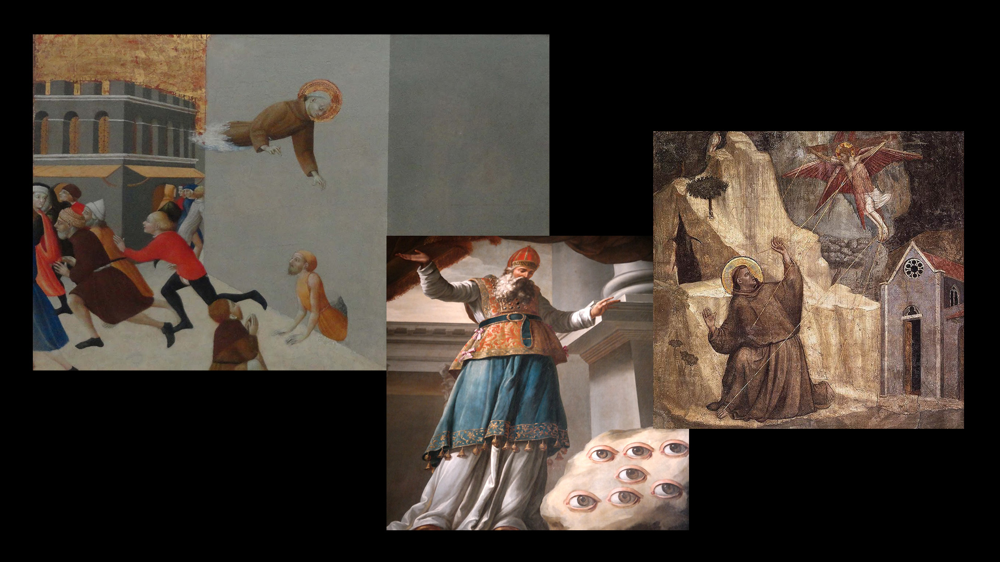

 
One of my core interests as an artist is the construction of indefinate yet stimulating and believable situations. I refer to this state, that is neither commpletely alien nor completely comprehensible as a “Teeming Unknown”. 

I've recently discovered Kenya Hara's book “Ex-Formation” in which he poignantly expresses the core motivation behind 

>What moves poeple's hearts, in every case, is the unknown. Things that people already know don't excite them.  
>[*Kenya Hara, Ex-Formation*](https://www.lars-mueller-publishers.com/ex-formation?classes=tiny)

The unknown represents a potential. It draws attention, it sparks our imagination, it gets attacked by our analytic minds, it sparks curiosity and desire.
unformation? the yielding unknown.

 The unknown is a volatile state because it represents something unsettled, it constantly strives to become known.
 In order to make it known we need to take it apart and link it to our current understanding.
 The creation of links and relations to something we already know is very strong - it is a process of integration, it elevates our self by making it our consciousness more complex (> Mihaly Csikszentmihalyi). It unifies our self with the subject, history, concepts, people and objects and represents a form of enlightenment. 
 
 When something becomes ordinary it ceases to produce this sensation. Instead of integration this represents a process of distinction
 
 ###A desirable unknown
 
 There is of course a kind of Unknown that is too detached from our consciousness. One which doesn't resemble anything we know, doesn't share any links or decodeable information.
 Such an Unknown is noise or entropy. It serves a purpose in itself by representing void or emptiness but is useless for our quest for the construction of the *Teeming Unknown*
 
There is of course a natural decay of understanding through history.

>People want to know up until the time they know, then they don't care.  
>[*David Lynch, Interview in the Sydney Morning Herald about Twin Peaks (May 2017)*](https://www.smh.com.au/entertainment/tv-and-radio/david-lynch-on-the-return-of-twin-peaks-and-why-he-will-never-make-another-film-20170416-gvlr60.html?classes=tiny)
 
 ##Things that are several things -
 ###Arrangement, Collage and Context  
 
 We aim for the far-fetched, the long-distance short circuitsSymbolism connects a thing to a concept. Through symbolification an object becomes extraordinary it begins to exist in a different realm where different connections are possible. modes of existence: eg apple
	* actual (fruit, food, organic)
	* formal (spherical, round; size, color)
	* symbolic, allegoric, metaphoric (sin, paradise, fertility...)
	* myth, narrative (newton)
	* specific (company, adam's apple body part, augapfel,...)

x-degrees of separation of things

##Delight in the Expected

People tend to delight in the expected. A transformation of the description of the thing into an experience of the thing. the safe place that doesn't challenge us with surprises. Kenya Hara, Ex-Formation

##Emergence

One potent tool in the construction of the unfamiliar is the employment of generative strategies. The integration of all elements into a system with concise rules and relations yields a hermetic consistency and a sense of interconnectedness and synchronicity. Even if individual parts might appear incomprehensible, meaning can arise from it implicitly. We can rely on the system's emergent behaviour - the phenomenon that such a system is able to produce structured complexities that are unpredictable by looking at its isolated parts. It requires the system to be “alive”, running - no static snapshot will suffice. 
One needs time to delve into the system and experience its behaviour.

